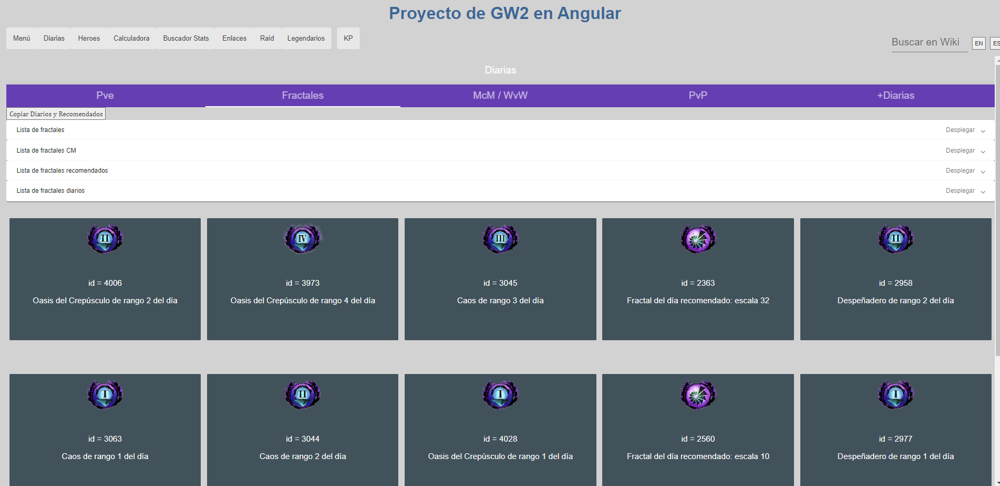

# Gw2Angular

IMPORTANTE: Introducir api key del juego en `.\service\key.ts` para ver la información de cada cuenta.

- Ver diarias de pve/fractales/WvW/PvP de nivel 80.
- Heroes: tabla con los personajes de la cuenta con información básica.
- Calculadora del bazar: para aplicar un porcentaje de reducción a un precio.
- Buscador stats por atributos, stats por prefijo y por nombre. ESP/ENG.
- Enlaces a determinados sitios web de ayuda.
- Raid: seguimiento de los bosses de raid hechos de la semana.
- Legendarios: ver los objetos necesarios que faltan para la armadura legendaria de PvE, sellos y runas, y precios de los T6.
- Buscador en la wiki oficial.

## Development server

Navigate to directory `.\gw2Angular`. Run `ng serve --open` for a dev server. Navigate to `http://localhost:4200/`. The app will automatically reload if you change any of the source files.

Works on node <= v16.20.1 & angular cli v >= 12.2.0

## Build

Run `ng build` to build the project. The build artifacts will be stored in the `dist/` directory.

## Imágenes

## TODO

Vista de cada heroe individual al pinchar en su nombre con información básica.

Hacer un formulario para meter la api (¿y codificarla?) antes de todo.

## Further help

https://angular.io/cli