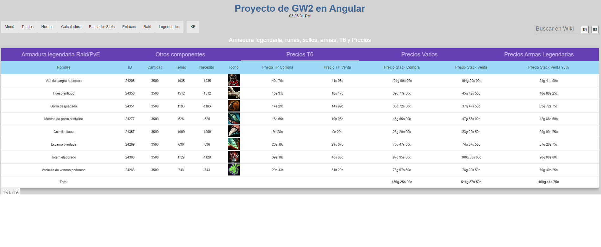

# Gw2Angular

IMPORTANTE: Introducir tu API key de tu cuenta de GW2 en `.\service\key.ts` para ver la información. Requisitos necesarios de la API key: `account`, `inventories`, `characters`, `wallet`, `unlocks`, `builds`, `progression`.

Esta aplicación permite:
- Ver diarias de la cámara del brujo, fractales diarios con info y otras diarias de interés.
- Héroes: tabla con los personajes de la cuenta con información básica.
- Calculadora del bazar: para aplicar un porcentaje de reducción a un precio y ver valor final calculado.
- Buscador de stats por atributos, stats por prefijo y stats por nombre. ESP/ENG.
- Enlaces a determinados sitios web de ayuda.
- Raid: seguimiento de los bosses de raid hechos de la semana.
- Legendarios: ver los objetos necesarios que faltan para la armadura legendaria de PvE, sellos y runas legendarios, precios de los T6, precios de items varios y precios/desbloqueos/variantes de armas legendarias de 1ª, 2ª y 3ª generación.
- Buscador en la wiki oficial ESP/ENG.

## Development server

Navigate to directory `.\gw2Angular`. Run `ng serve --open` for a dev server. Navigate to `http://localhost:4200/`. The app will automatically reload if you change any of the source files.

Tested and works on node <= v16.20.1 & angular cli v >= 12.2.0

## Build

Run `ng build` or `ng build --prod` to build the project. The build artifacts will be stored in the `dist/gw2Angular` directory.

## Screenshots




## Thanks to
- Arenanet's [API](https://wiki.guildwars2.com/wiki/API:2)
- [Invisi](https://github.com/Invisi) for his [instabilities fractal repo]([https://github.com/Invisi/gw2-fotm-instabilities])

## Further help

https://angular.io/cli

## For Raspberry Pi (tested in 3b+)
Angular version:
- `npm install -g @angular/cli@12.2.12`

Node version:
- `nvm install 14.21.2` For nvm install see: https://github.com/nvm-sh/nvm

pm2
- `npm install pm2 -g`

Then:
- `cd gw2Angular/gw2Angular`
- `nvm use 14.21.2`

And choose one of these:
- `ng serve --host 0.0.0.0 --disable-host-check`

- `pm2 start "ng serve --host 0.0.0.0 --disable-host-check" --watch --name "GW2Angular"`
or
- `pm2 start "NODE_OPTIONS='--max_old_space_size=2048' ng serve --host 0.0.0.0 --disable-host-check" --watch --name "GW2Angular"`
*NOTE: starting pm2 with ngserve, it is not necessary to run pm2 restart*

For initializing pm2 on raspberry boot:
- `pm2 startup`
- `sudo env PATH=$PATH:/home/YOURUSER/.nvm/versions/node/v14.21.2/bin /home/YOURUSER/.nvm/versions/node/v14.21.2/lib/node_modules/pm2/bin/pm2 startup systemd -u YOURUSER --hp /home/YOURUSER`
- `pm2 save`
- `pm2 status (to watch the processes)`

If we have installed the correct angular and node and we want to see that it is working:
- `cd gw2Angular/gw2Angular`
- `nvm use 14.21.2`
- `pm2 status`

## Serve with Apache2
Install Apache2:
- `sudo apt install apache2 -y`

Create file .htaccess inside gw2Angular/gw2Angular/src with:
````
RewriteEngine On
# If an existing asset or directory is requested go to it as it is
RewriteCond %{DOCUMENT_ROOT}%{REQUEST_URI} -f [OR]
RewriteCond %{DOCUMENT_ROOT}%{REQUEST_URI} -d
RewriteRule ^ - [L]

# If the requested resource doesn't exist, use index.html
RewriteRule ^ /index.html
````
and add this line to angular.json:
```
"assets": [
              "src/favicon.ico",
              "src/assets",
              "src/.htaccess"       <--- add this line>
            ],
```

Then:
- `ng build`

Copy build folder to Apache2 directory and verify all files are copied (included .htaccess):
- `cd gw2Angular/gw2Angular/dist/gw2Angular/`
- `sudo cp -r * /var/www/html`

Enable mod rewrite on Apache2
- `sudo a2enmod rewrite`

Modify the file:
- `sudo nano /etc/apache2/apache2.conf`
with:
```
<Directory /var/www/>
        Options Indexes FollowSymLinks
        AllowOverride All   <--- Change from None to All>
        Require all granted
</Directory>
```
Restart Apache2 service:
- `sudo service apache2 restart`

## Possible Errors in Rasp

To see the amount of memory:
- `node -e 'console.log(v8.getHeapStatistics().heap_size_limit/(1024*1024))'`

If memory error occurs:
- `export NODE_OPTIONS=--max_old_space_size=2048`

If you can't find the ng command:
- `npm link @angular/cli`

If the ngcc gives errors:
- `rm node_modules/@angular/compiler-cli/ngcc/__ngcc_lock_file__`